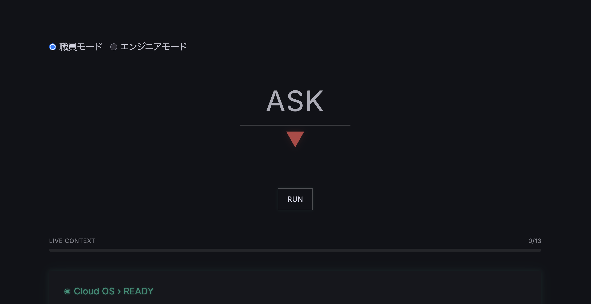

# Cloud OS Intelligence

 

Understand your AWS cloud through natural language.

> <mark>**The system evolved.**</mark>  
> **The interface did not.**

---

 

## What is Cloud OS Intelligence?

 

Cloud OS Intelligence is a **concept-driven observability interface** designed to help people <u>**understand cloud systems through natural language**</u>.

Instead of navigating complex `dashboards`, `APIs`, and `operational layers`, users interact with cloud environments through a simplified conversational interface.

- Cloud OS Intelligence focuses on:

  - Understanding over operation
  - Natural language interaction
  - Domain-bounded intelligence
  - Deterministic system behavior
  - Human-centered observability

---

 

## Philosophy

 

>**Modern cloud systems became extremely powerful.**

- At the same time:

  - architectures became distributed
  - operational knowledge became fragmented
  - interfaces remained engineer-centric

Cloud OS Intelligence explores a different direction:

> What if cloud systems could explain themselves?

---

 

## Concept

 

> Cloud OS Intelligence combines:

- **Observability**
- **Prompt Engineering**
- **LLMs**(LMMs)**-assisted interpretation**
- **Grafana dashboards**
- **Structured operational context**

The goal is not to replace engineers.

>>The goal is **to make cloud systems more understandable for everyone.**

---

 

## Experience Design

 

Cloud OS Intelligence follows a <mark>**Zen-style**</mark> interface philosophy:

- ✅ **Minimal interaction**
- ✅ **Reduced operational complexity**
- ✅ **Focused system boundaries**
- ✅ **Calm visual design**
- ✅ **Deterministic responses**

The interface is **intentionally simple**.

>>**Because complexity already exists inside the system.**

---

 

## ASK

 

- Instead of:

  - 🚫 APIs
  - 🚫 Query languages
  - 🚫 Dashboard hunting
  - 🚫 Infrastructure terminology

>>**Users simply ASK.**

---

 

## Architecture Overview

 

[Architecture Diagram Here]

Cloud OS Intelligence separates:

- Interface orchestration
- Prompt construction
- System identity
- Operational context
- Structured knowledge generation

This architecture allows Cloud OS Intelligence to maintain stable and **domain-focused responses**. 
Cloud OS is designed as a <u>specialized operational intelligence interface</u> for cloud environments — not a general-purpose AI assistant.

---

 

### Screenshots

 

[Dashboard Screenshot]

[Typing Scene Screenshot]

[Movie Ending Screenshot]

---

 

### Concept Movie

 

[🍿**movie**](./movie/Cloud_OS_Intelligence_Intro.mov)

The Cloud OS Intelligence concept movie represents the core idea behind the project:

> **Not APIs.**  
> <mark>**But Natural Language.**</mark>

---

 

## Vision

 

Cloud OS Intelligence is currently being explored as a **next-generation operational interface** for <u>AWS observability environments</u>.

- Potential future directions include:

  - Municipal cloud operations
  - AI-assisted observability
  - Drift intelligence
  - Operational knowledge systems
  - Human-centered cloud interfaces

---

 

## Status

 

Cloud OS Intelligence is currently an experimental concept and architecture project.

- **This repository exists** to document:

  - **Product vision**
  - **UX direction**
  - **Interface philosophy**
  - **Architecture concepts**
  - **Development history**

---

 

## Just ASK.

---
