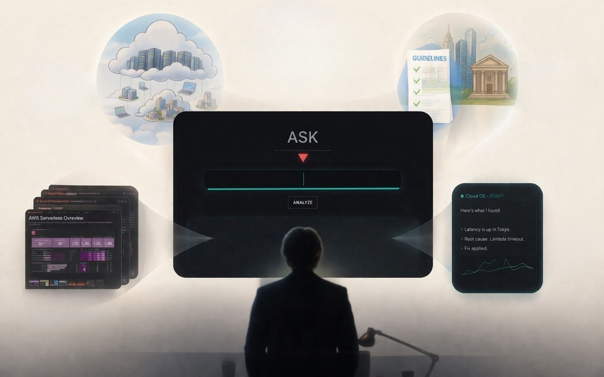

# Cloud OS Intelligence

 

Understand your AWS cloud through natural language.

> The system evolved.  
> The interface did not.

---

 

## What is Cloud OS?

 

Cloud OS is a concept-driven observability interface designed to help people understand cloud systems through natural language.

Instead of navigating complex dashboards, APIs, and operational layers, users interact with cloud environments through a simplified conversational interface.

Cloud OS focuses on:

- Understanding over operation
- Natural language interaction
- Domain-bounded intelligence
- Deterministic system behavior
- Human-centered observability

---

 

## Philosophy

 

Modern cloud systems became extremely powerful.

At the same time:

- architectures became distributed
- operational knowledge became fragmented
- interfaces remained engineer-centric

Cloud OS explores a different direction:

> What if cloud systems could explain themselves?

---

 

## Concept

 

Cloud OS combines:

- Observability
- Prompt Engineering
- AI-assisted interpretation
- Grafana dashboards
- Structured operational context

The goal is not to replace engineers.

The goal is to make cloud systems more understandable for everyone.

---

 

## Experience Design

 

Cloud OS follows a Zen-style interface philosophy:

- Minimal interaction
- Reduced operational complexity
- Focused system boundaries
- Calm visual design
- Deterministic responses

The interface is intentionally simple.

Because complexity already exists inside the system.

---

 

## ASK

 

Instead of:

- APIs
- Query languages
- Dashboard hunting
- Infrastructure terminology

Users simply ASK.

---

 

## Architecture Overview

[Architecture Diagram Here]

Cloud OS separates:

- Interface orchestration
- Prompt construction
- System identity
- Operational context
- Structured knowledge generation

This architecture allows Cloud OS to maintain stable and domain-focused responses.

---

 

### Screenshots

[Dashboard Screenshot]

[Typing Scene Screenshot]

[Movie Ending Screenshot]

---

 

### Concept Movie

[movie](./movie/Cloud_OS_Intelligence_Intro.mov)

The Cloud OS concept movie represents the core idea behind the project:

> Not APIs.  
> But Natural Language.

---

 

## Vision

Cloud OS is currently being explored as a next-generation operational interface for AWS observability environments.

Potential future directions include:

- Municipal cloud operations
- AI-assisted observability
- Drift intelligence
- Operational knowledge systems
- Human-centered cloud interfaces

---

 

## Status

Cloud OS is currently an experimental concept and architecture project.

This repository exists to document:

- Product vision
- UX direction
- Interface philosophy
- Architecture concepts
- Development history

---

 

## Just ASK.

[Ending Image Here]

---
